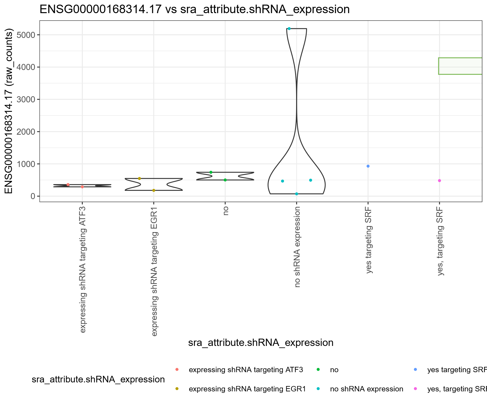

# Ejercicio — Visualización con iSEE

## Ejericio 4.4

Reproducir una visualización utilizando iSEE con:

-   Dynamic feature selection
-   Información de las columnas para el eje X
-   Información de las columnas para los colores

------------------------------------------------------------------------

## Resultado

